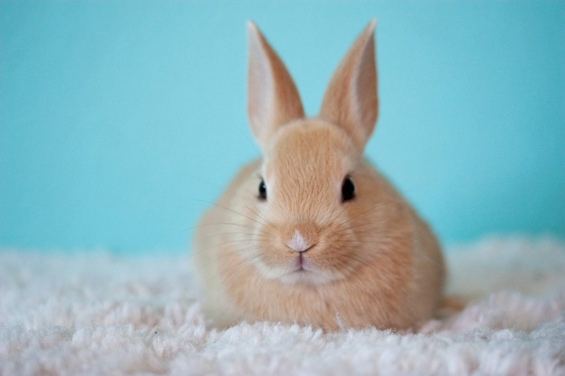

# Tudo sobre Coelhos

Os **coelhos** são pequenos mamíferos herbívoros conhecidos pela sua rapidez e fofura!  
Eles pertencem à família *Leporidae* e são encontrados em várias partes do mundo.

## Características dos Coelhos

- **Tamanho:** Pequenos a médios  
- **Alimentação:** *Herbívora* (feno, vegetais, frutas)  
- **Esperança de vida:** **8 a 12 anos**  
- **Habitat:** Florestas, campos e até casas!  

## Tipos de Coelhos

1. **Coelho Anão:** Pequeno e dócil
2. **Coelho Rex:** Pelo macio e curto  
3. **Coelho Angorá:** Famoso pelo pelo longo e fofinho  

## Alimentação Saudável

Os coelhos precisam de uma dieta equilibrada:
- **80%** de *feno*
- **10%** de *vegetais frescos* 
- **5%** de *ração específica para coelhos*  
- **5%** de *frutas como maçã e banana* em [Artigo sobre Coelhos na Wikipédia](https://pt.wikipedia.org/wiki/Coelho)

## Fotografia de um Coelho

## Links Úteis

Link para saber mais sobre coelhos:
- [Artigo sobre Coelhos na Wikipédia](https://pt.wikipedia.org/wiki/Coelho)  

